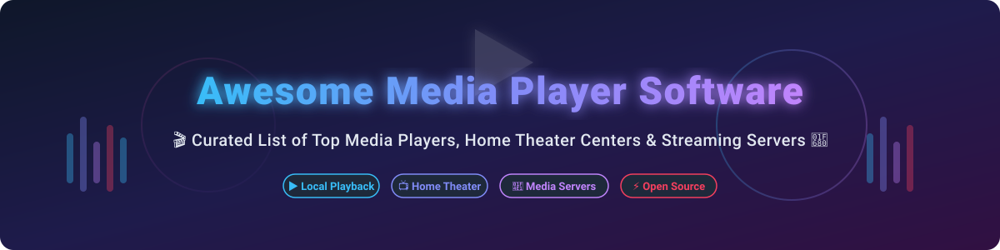

# 🎬 Awesome Media Player Software

  
  
  
  
  

---

## 📌 Overview & SEO Keywords

Welcome to the ultimate curated list of **Awesome Media Player Software**, **Open-Source Video Players**, **Streaming Media Servers**, and **Cross-Platform Home Theater Centers**.

Whether you are looking for light-weight local desktop playback, 4K HDR hardware acceleration, spatial audio rendering, subtitle syncing, or self-hosted media streaming servers, this repository ranks and details top-tier open-source projects, freeware tools, and SaaS media platforms.

**Keywords**: `media player`, `video player`, `open source video player`, `streaming server`, `home theater pc`, `vlc alternative`, `mpv GUI`, `media server`, `4k hdr media player`, `freeware media player`, `cross platform audio player`.

📅 **Last updated**: October 2026

---

## 📖 Table of Contents

- [💼 Commercial & Freeware Players](#-commercial--freeware-players)
- [🔓 Open-Source GitHub Projects](#-open-source-github-projects)
- [🤝 How to Contribute](#-how-to-contribute)
- [❤️ Support & Sponsorship](#%EF%B8%8F-support--sponsorship)
- [⚠️ Disclaimer](#%EF%B8%8F-disclaimer)
- [📈 Star History](#-star-history)

---

## 💼 Commercial & Freeware Players

> **📊 Market Context**: The global media player market is estimated at **~$2B in 2026**, growing toward **~$4B by 2032**. The sector is **moderately fragmented** — **VLC** dominates the open-source cross-platform tier, **Windows Media Player** ships with Windows, **PotPlayer** leads the Windows power-user segment, **KMPlayer** and **GOM Player** compete in Asia-Pacific, and **5KPlayer** targets macOS users. **Pricing varies dramatically**: **VLC**, **Kodi**, **MPC-HC**, **IINA**, and **mpv** are **completely free and open source**, while **Plex** offers a **free media server** with **Plex Pass at $4.99/month or $119.99 lifetime** for premium features. **Windows Media Player** is bundled with Windows at no extra cost. **PotPlayer**, **KMPlayer**, and **GOM Player** are **freeware** (closed source). No single vendor holds a winner-take-all position.

| Player | Description | Pricing (Starting Tier) | Free Tier Limits | Company Size |
|--------|-------------|------------------------|------------------|--------------|
| **[Windows Media Player](https://support.microsoft.com/en-us/windows/windows-media-player)** | **Microsoft's default media player.** Legacy WMP plus the modern "Media Player" app for Windows 11. Plays common formats with basic library management. | **Free** — bundled with Windows OS | **Unlimited** — complete feature set included free with Windows license | **~$281B revenue (Microsoft FY2025)** |
| **[PotPlayer](https://potplayer.daum.net/)** | **The power user's Windows player.** Rich feature set, extensive customization, and hardware acceleration. **Closed source freeware**. | **Free** — 100% freeware download | **Unlimited** — full access to all video playback, 3D, and skin features with no time limits | **~$5.9B revenue / KRW 8.09T (Kakao FY2025)** |
| **[KMPlayer](https://www.kmplayer.com/)** | **Feature-rich Windows media player.** 3D/VR support, subtitle handling, and format conversion. **Freeware**. | **Free** — 100% freeware download | **Unlimited** — full access to 4K/8K playback and VR rendering with ad-supported installer options | **~$10M–$20M revenue (Pandora TV Co., Ltd.)** |
| **[GOM Player](https://www.gomlab.com/)** | **Popular Windows player in Asia.** Built-in codec library, 360-degree VR playback, and subtitle search. **Freeware**. | **Free** — freeware tier ($15 one-time for GOM Player Plus) | **Unlimited** — free forever with ad banners; paid tier removes ads and optimizes 4K playback | **~$5M–$15M revenue (GOM & Company)** |
| **[5KPlayer](https://www.5kplayer.com/)** | **macOS/Windows player with AirPlay and DLNA.** Plays 4K/5K/8K video and supports streaming. **Freeware**. | **Free** — 100% freeware download | **Unlimited** — full access to 4K playback, YouTube downloader, and AirPlay mirror tools after free email registration | **~$2M–$10M revenue (DearMob / Digiarty Software)** |
| **[VLC Media Player](https://www.videolan.org/)** | **The universal media player.** Plays virtually everything — files, discs, streams, devices — on every platform. **GPLv2** licensed, **billions of downloads**. | **Free** — open source GPLv2 | **Unlimited** — free forever without restrictions, advertisements, or telemetry | **Nonprofit (VideoLAN organization)** |

---

## 🔓 Open-Source GitHub Projects

The open-source media player ecosystem is **exceptionally mature and production-proven**. Below is a comprehensive list of top open-source media software repositories, sorted by GitHub Stars_Count in descending order:

| Repo | Description | GitHub_Stars |
|------|-------------|--------------|
| **[IINA](https://github.com/iina/iina)** | **The modern video player for macOS.** Built on **mpv** for best decoding capacity on macOS. Clean, native Swift interface designed for macOS 10.15+. **GPL-3.0**. |  |
| **[mpv](https://github.com/mpv-player/mpv)** | **The power user's VLC alternative.** Minimalist interface with exceptional video rendering quality (`gpu-next`). Hardware decoding, HDR playback, custom shaders, and Lua scripting. **GPL-2.0**. |  |
| **[Jellyfin](https://github.com/jellyfin/jellyfin)** | **The Free Software Media System.** Self-hosted open-source media server with zero ads, subscriptions, or telemetry. Cross-platform server and clients. **GPL-3.0**. |  |
| **[Kodi](https://github.com/xbmc/xbmc)** | **The ultimate home theater PC software.** 100% free and open-source media center with 10-foot interface for TVs and remotes. Plugins, skins, and network streaming support. **GPL-2.0**. |  |
| **[VLC Media Player](https://github.com/videolan/vlc)** | **The universal open-source media engine.** Cross-platform multimedia player playing virtually every video/audio format, disc, stream, and protocol. **GPL-2.0 / LGPL-2.1**. |  |
| **[Celluloid](https://github.com/celluloid-player/celluloid)** | **Simple GTK frontend for mpv.** Designed for Linux and GNOME desktop environments with GTK4 and libadwaita integration. **GPL-3.0**. |  |
| **[Media Player Classic - Home Cinema (MPC-HC)](https://github.com/clsid2/mpc-hc)** | **Lightweight media player for Windows.** Maintained fork of MPC-HC with LAV Filters, MPC Video Renderer, and dark theme UI. **GPL-3.0**. |  |
| **[Haruna](https://github.com/KDE/haruna)** | **Open-source video player built with Qt/QML and mpv.** Native KDE media player featuring youtube-dl/yt-dlp integration, mouse gestures, and custom actions. **GPL-3.0**. |  |
| **[Screenbox](https://github.com/huynhsontung/Screenbox)** | **Modern Windows & Xbox media player.** UWP interface built on LibVLC engine for smooth local playback on Windows 10/11 and Xbox consoles. **MIT**. |  |
| **[Audacious](https://github.com/audacious-media-player/audacious)** | **Lightweight advanced audio player.** Focuses on low resource usage, high audio quality, and Winamp classic skins. **BSD-2-Clause**. |  |
| **[Lunoir](https://github.com/zhbj420/Lunoir)** | **Beautiful Windows player powered by mpv.** Electron + React + mpv core with frosted-glass UI, Dolby Vision, HDR10+, YouTube playback, and IPTV live TV recording. **MIT**. |  |
| **[rein_player](https://github.com/Ahurein/rein_player)** | **Cross-platform video player inspired by PotPlayer.** Built with Flutter. Supports PotPlayer `.pbf` bookmarks, A-B loop segments, and custom keyboard shortcuts. **MIT**. |  |

---

## 🤝 How to Contribute

Contributions are very welcome! To suggest a new commercial or open-source media player:

1. Fork this repository on GitHub.
2. Edit `README.md` to add your item (follow the markdown table structure).
3. Include title, official website/repo link, key feature summary, pricing/license, and company size or Stars_Badge.
4. Submit a Pull Request (PR) with a brief summary of the addition.

---

## ❤️ Support & Sponsorship

Thank you for exploring and using **Awesome Media Player Software**! 🌟

If you find this list useful for discovering video players, streaming servers, or home theater setups, please consider supporting the project:

- 🌟 **Star this repository** to help others discover it.
- 🔀 **Fork and share** with fellow media enthusiasts and developers.
- ☕ **Buy me a coffee / Sponsor**: Support ongoing maintenance via [GitHub Sponsors](https://github.com/sponsors/ishandutta2007).

---

## ⚠️ Disclaimer

- This is a **community-curated list** provided for educational and informational purposes.
- Media players handle local media and network streams; users are responsible for complying with copyright and licensing regulations in their jurisdiction.
- **Codec Royalty Note**: Software bundling patented codecs (such as MPEG-LA patents) may be subject to regional licensing terms.

---

## 📈 Star History

---

  Made with ❤️ for media enthusiasts, home theater builders, power users, and open-source advocates.

